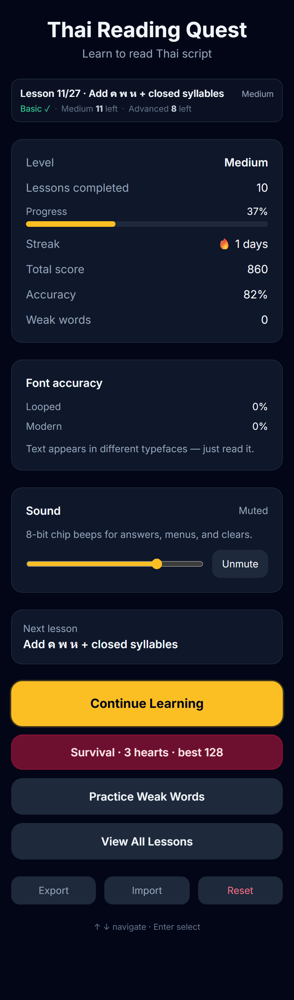
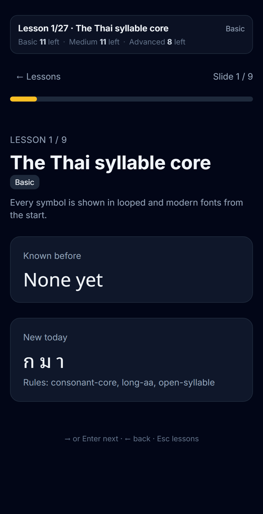
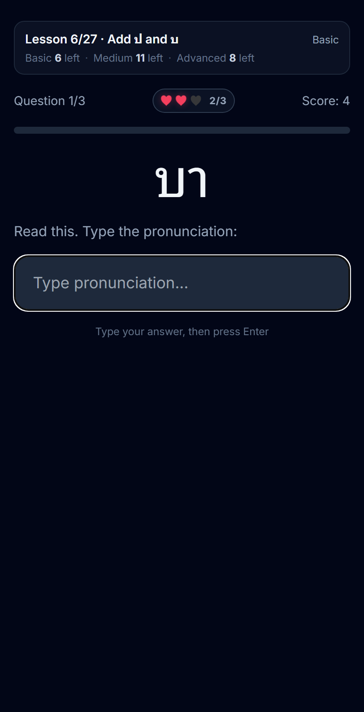
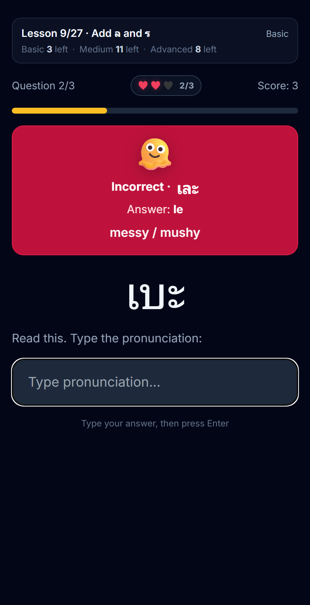
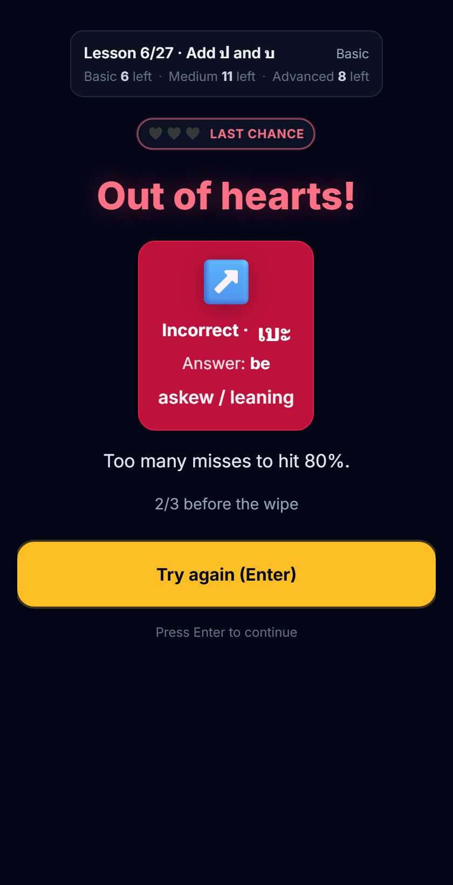
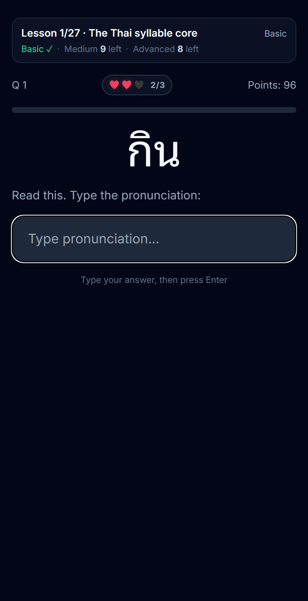

# Reading Thai

**Thai Reading Quest** — a keyboard-first browser tutor for learning to **read** Thai script (not speak it). Progress through Basic → Medium → Advanced lessons, take heart-limited tests, and try endless **Survival** mode.

**Play it:** [https://drakemor.github.io/reading-thai/](https://drakemor.github.io/reading-thai/)

## Screenshots

| Dashboard | Lesson |
| --- | --- |
|  |  |

| Quiz | Answer feedback |
| --- | --- |
|  |  |

| Out of hearts | Survival |
| --- | --- |
|  |  |

## Features

- **Curriculum** of consonants, vowels, and reading rules (closed syllables, tone marks, silent mark, …)
- **Reading quizzes** — type romanization or pick the pronunciation; fonts rotate (looped / modern)
- **Hearts** — miss too many and the test restarts (failed word stays until you continue)
- **Survival** — 3 hearts, length-weighted score, personal best + top runs in `localStorage`
- **Keyboard-first** — ↑↓, Enter, 1–4, Esc
- **8-bit chip audio** for UI / correct / wrong / death (muteable)

## Run locally

Static site — open `index.html`, or:

```bash
npm start
# → http://localhost:4173
```

## Demo / screenshot scenes

Force a mock UI without writing progress (useful for QA and README shots):

| URL | Scene |
| --- | --- |
| `/?demo=dashboard` | Mid-progress home |
| `/?demo=lesson` | Lesson teaching slide |
| `/?demo=quiz` | Active reading question |
| `/?demo=feedback` | Incorrect answer card |
| `/?demo=death` | Out-of-hearts hold screen |
| `/?demo=survival` | Survival run in progress |

Regenerate PNGs:

```bash
npm install
npx playwright install chromium
npm run screenshots
```

## Deploy (GitHub Pages)

This repo is set up for **Pages from the `main` branch root** (`/`). After push, the site is at:

`https://<user>.github.io/reading-thai/`

## Project layout

```
index.html          App shell
css/styles.css      Layout + animations
js/data.js          Symbols, word bank, lessons
js/audio.js         Chip synth
js/app.js           State, quizzes, Survival, demo hooks
scripts/            Smoke test + screenshot capture
docs/screenshots/   README images
```

## License

MIT
